# T2A2 Marketplace App #

## Pixeltastic – Stock Photography Website Application ##

### What is the problem you are trying to solve by building this particular marketplace app? (R7) ###

Stock photography websites allow photographers to sell their images to many potential buyers while providing buyers the opportunity to choose from many images from many different photographers. 

There are many stock photography websites available for users to buy and sell images, including larger sites such as Adobe Stock and Shutterstock. These websites typically have strict rules about the images they accept for sale. These websites often reject photos for many reasons such as noisy images (grainy appearance), out of focus elements, or overexposed or underexposed images. Creative photography often involves the deliberate manipulation of these elements. Many creative images are therefore rejected from these websites. 

Additionally, the rules about what type of images are accepted are applied inconsistently between various stock photography websites. The same image that is accepted at one website may be rejected by others, leading to frustration for photographers and duplication of submission across many sites. 

Stock photography websites also typically specify a minimum image size. Limiting the accepted file size to a minimum size excludes some images, such as those taken with older cameras or phones, or images which have been cropped to highlight a particular element, which result in a stronger composition. This reduces the number of images available on a particular subject. 

Virtually all stock photography websites have set prices at which they sell their images. They do not allow the seller to set the price for their individual images. Therefore, these websites are not genuine marketplaces where prices are determined by interaction between buyers and sellers. 

### Why does this problem need to be solved? (R8) ###

The strict standards applied by traditional stock photography websites on the images they accept limits the amount of creative photos available for wider use. This results in many stock photos being very similar and having a generic, or conspicuously stock photo, feel to them. These limits also exclude some creative photographers from show-casing their work and earning a potential source of additional income. 

The inconsistencies in the application of the rules on which images are accepted  may discourage photographers from submitting their images, which limits the photos available to potential buyers. The limitations on accepted file sizes also limits which images are available to potential buyers. This ignores the needs of many potential buyers who may value having a greater range of images available over the need for very high-quality images, such as in the case of using images on websites or for educational purposes, where high resolution images may not be required. 

Strict limits on file sizes also limits the images that are available to potential buyers for subjects that may be difficult to photograph as close range, such as insects or other wildlife. In these cases, taking photos from a distance and then cropping those photos to enhance the composition results in a smaller file size but stronger composition. 

A stock photography website that allows sellers to set the prices for each of their photos caters to a wider range of photographers, ranging from professionals who may expect to sell their images for a higher price to hobby photographers who may be more interested in exposure than income. 

### Website Link (R9) ###
The deployed application is available at:

https://pixeltastic.herokuapp.com/

Please note you will need to create an account and log in to access all the features of the app. You will be able to view the home page, image catalogue and help page without creating an account. 

### GitHub repository (R10) ###
The source code for the application can be found on GitHub at:

https://github.com/katherine-rock/pixeltastic

### Overview of the marketplace app (R11) ###

#### Purpose ####
The purpose of the __Pixeltastic__ stock photography app is to provide a 2-sided open marketplace for users to buy and sell photos at a price set by the seller and without limits on creativity. 

#### Functionality / features ####

__Pixeltastic__ provides users the ability to upload photos with a title, description, category and price for sale. Once an image is uploaded, the owner of that image has access to edit or delete the listing for that photo. Access to perform these actions is limited to the image owner with the use of the Pundit ruby gem for authorisation. Access to these functions is also limited at the browser level by only displaying these options to the image owner. Each user’s uploaded images are available for review and editing through the ‘portfolio’ page. 

Users can buy individual images after setting up an account. Payments are managed through Stripe payments. 

Users only need to create an account once in order to access the features to be either a buyer or seller or both. 

__Pixeltastic__ features user authentication to limit user access to various functions. Any visitors to the website can view the home page which features the 6 most recently added images and the image catalogue page that features all available images. In order to upload or buy a photo, the user must create an account and log in. Authentication is managed with the ‘Devise’ ruby gem.  

The following features will be added to future releases:
* Search function 
* Public user portfolios

#### Sitemap ####
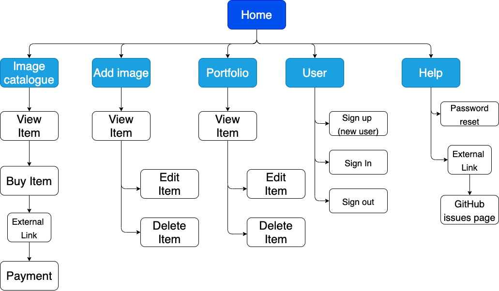

#### Screenshots ####
Home

View Photo Listing

View Image Catalogue

Please note the user portfolio page follows the same layout as the image catalogue page. 

Upload New Photo 
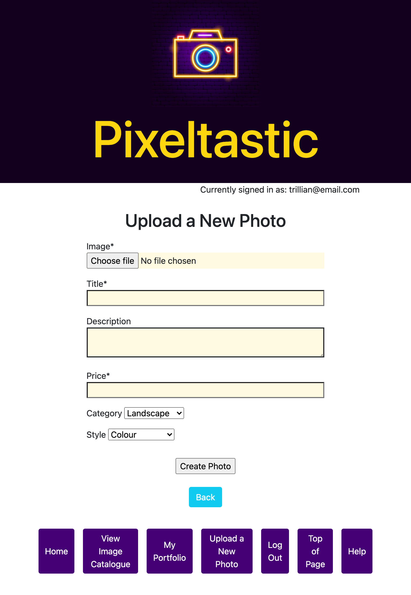

Upload New Photo 
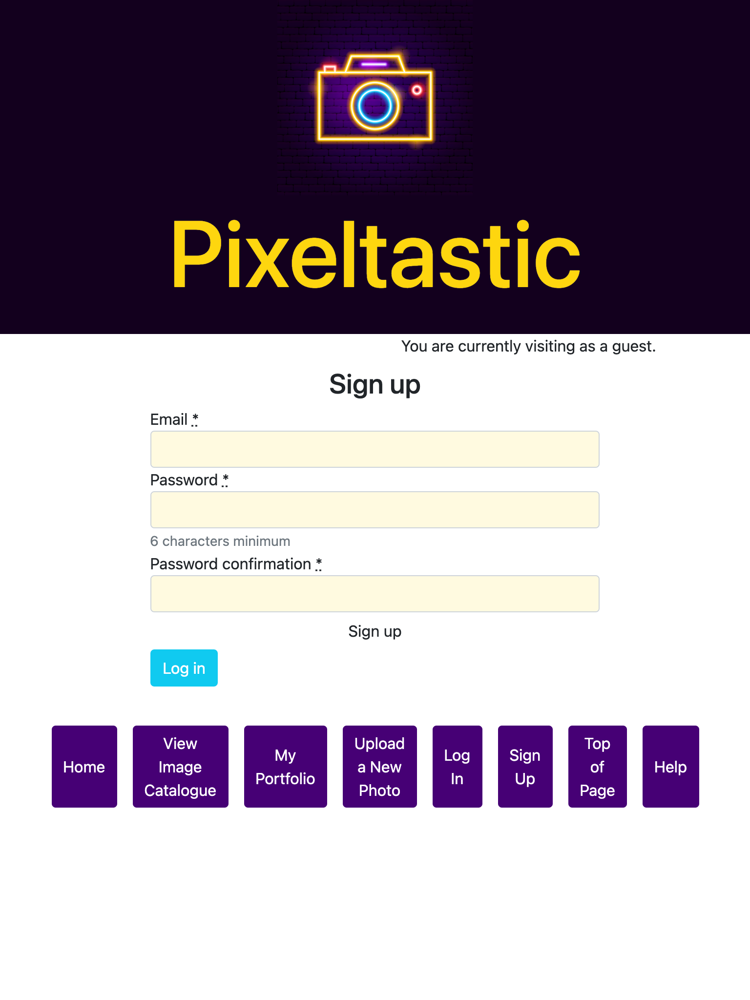
Please note the log in and log out pages follow the same layout as the sign up page. 

Help 
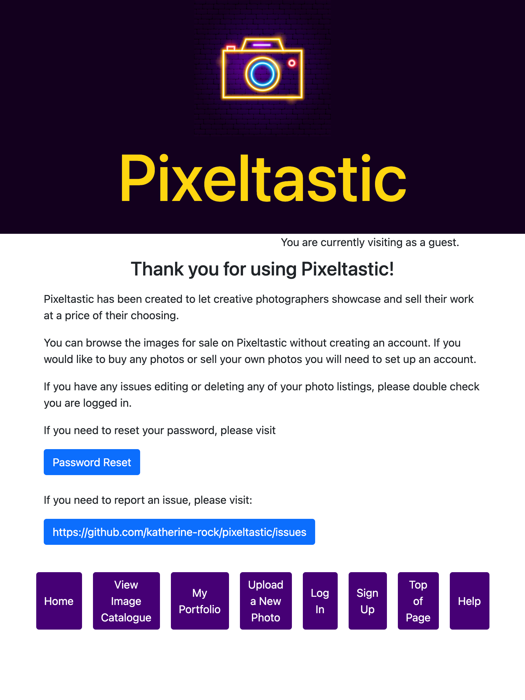

#### Target audience ####
The target audience for the Pixeltastic marketplace app is professional and hobby photographers looking to sell their creative photos, and people looking to buy creative photos for personal or professional use. 

#### Tech stack ####
The app has been prepared using:
* Ruby on rails version 6.1.3.2
* PostgreSQL version 13.2
* HTML
* CSS
* Heroku for deployment 

Ruby Gems: 
* Devise for authentication (França, et al., 2021)
* Pundit for authorisation (Licensed by MIT, 2021)
* Simple Form (França & da Silva, 2021)
* Bootstrap for styling (Licensed by MIT, 2021) 
* Stripe for payments (Stripe, 2021)

### User stories (R12) ###
__Essential__ 

As a creative photographer, I want to sell photos that contain creative elements so they stand out from generic stock photography images.

As a photographer, I want to sell photos even if the file size is small, so I have a greater range of images available for sale

As a professional photographer looking to earn income from selling my photos, I want to be able to set the price of the images I sell. 

As a photographer, I want to be able to update the price of the images I am selling in response to buyer demand. 

As a hobby photographer, I want to set the price of the images I sell so I can compete against more established photographers. 

As a hobby photographer, I would like to sell photos without needing to set up a website.  

As a student, I want even images I can use for assignments, if they are only available as small images.  

As a website developer, I want access to images that are already cropped to have a strong composition.

As a developing photographer, I want to be able to easily add and remove photos from my portfolio so my portfolio reflects my best photos. 

As an educator, I want photos I can use for demonstrations even if the resolution is not high. 

__Desirable__
As a photo buyer, I want to be able to search for images with keywords. 

As a photographer, I want to be able to display my images for sale as a portfolio to external parties.

As a hobby photographer, I would like to set up an online portfolio without needing to spend money.

__Nice to have__
As a photo buyer, I want to be able to sort photos by their price. 

### Wireframes (R13) ###
Wireframes were prepared with a minimalist design in mind so the application layout would not distract or conflict with the images for sale, which is the main purpose of the app. 

The initial wireframes for mobile and tablet did not include images on the home page as it was thought this would require too much scrolling for the user to access the main features of the app. During the build phase it became obvious that including a limited number of images resulted in a more engaging design and did not add significantly to the amount of work for users to access the app’s features.  

Home
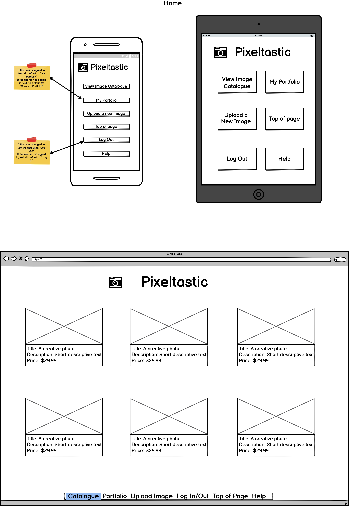

Image Catalogue
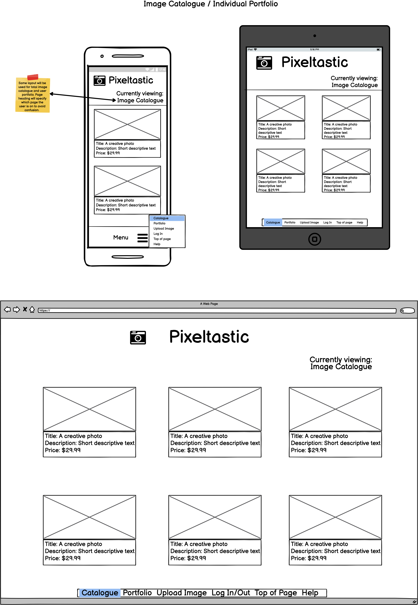

Upload New Photo
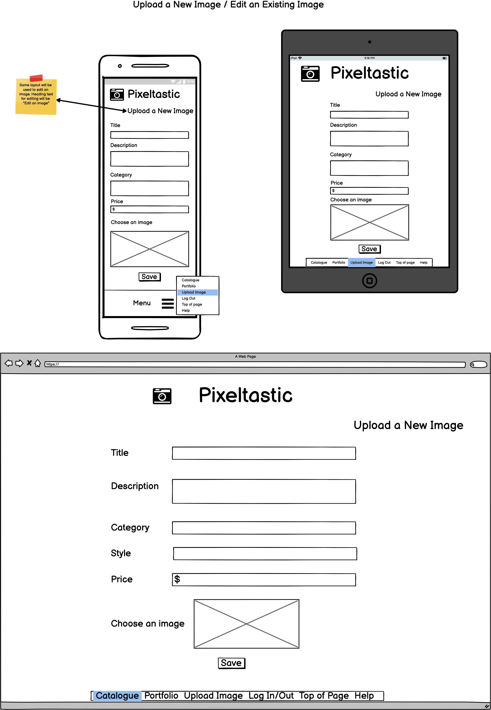

View Photo
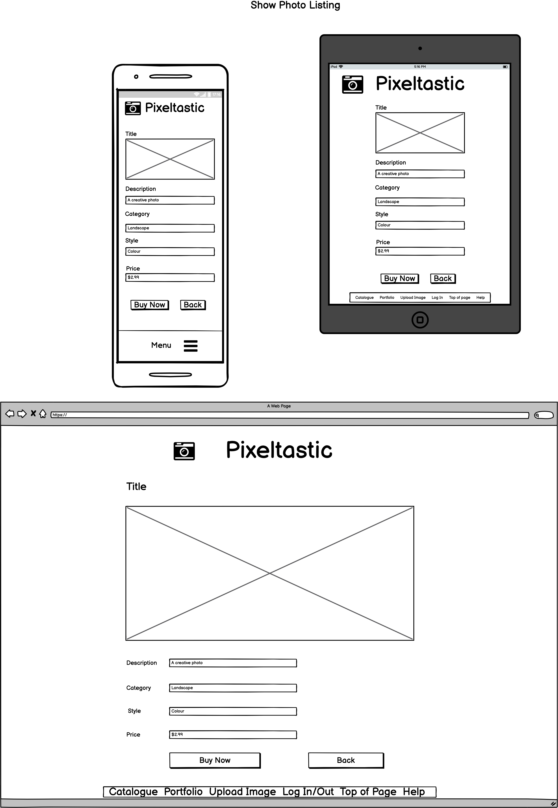

### Entity Relationship Diagram and Database Schema Design (R14, R19) ###
The entities within the app are summarised by the following diagram. These entities are explained in more detail below. Please note that ‘created_at’ and ‘updated_at’ are included as columns for each table but are not included in the diagram below to reduce repetition.  

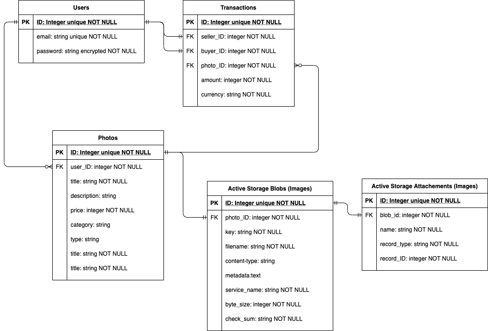

### Database relations (R18) ###
As per the entity relationship diagram above, the data for the application is organised by user, photo listing, transactions between users to sell/purchase photos, and data associated with storage of the photos. 

The __users__ table contains the essential information for each user who signs up to use the application. Each user can have nil or many photos available for sale. Each photo can only have one user who is selling the photo. Individual photos are linked to the user selling the photo by the user ID and photo ID.  

Data related to each photo for sale is organised in multiple tables in the database. The __photos__ table contains information related to the photo listing, including the photo title, description, price and other general descriptive information. Information related to the photo image itself is stored in two other tables in the database, Active Storage Attachments  and Active Storage Blobs. 

__Active Storage Blobs__ stores the details of the uploaded files including the file name, metadata and content type. The key is associated with the file in the storage service. 

The __Active Storage Attachments__ table joins the storage blob to the associated record, in this case the photo listing. 

The __transactions__ table is a join table in the database that records the ID of the photo being sold, the buyer’s ID, the seller’s ID and the total price paid. 

### High-level components / abstractions used in the app (R15) ###

The real-world entities that are included as abstractions in the app include a marketplace for buying and selling photographs which is represented by the app itself, buyers and sellers of photographs, and  transactions to exchange a photo for money. 

A real-world photography marketplace would be made up of photographers selling photos and potential buyers for those photos. The marketplace can be thought of as a series of market stalls with many photographers in one geographic location marketing their photos to many potential buyers. The marketplace may also feature casual browsers who are interested in viewing the products but do not intend to buy anything. The marketplace is represented by the app itself. 

Buyers and sellers are included in the app in the form of users. Each user can be both a buyer and seller, just as in real life when a photographer may sell photos to others or buy photos from other stalls. Casual browsers who may view the products but do not intend to buy anything are not specifically represented in the app’s models, but these users are accommodated as all photos available for sale are freely available for viewing, just like stock in a real-life marketplace. 

A real-life marketplace would involve the exchange of a photo for money. This is managed as a transaction in the app, with a credit card payment processed electronically prior to providing the user (buyer) with access to download the image file.  

### Third-party services used by the app (R16) ###
The following third-party services have been used by the app. 
__Heroku__ has been used to deploy the application. Heroku provides a cloud-based platform for developers to deploy and manage apps. (Heroku, 2021)

__GitHub__ has been used for version control and to integrate with Heroku for deployment. (Heroku, 2020) 

__Amazon Web Services S3__ has been used for remote storage of images. Amazon S3 can store large amounts of data to be accessed from anywhere. It is fast, highly reliable and inexpensive. (Amazon, 2021)

__Stripe__ has been used to process credit card payments securely online. Stripe provides a pre-built checkout page which creates a checkout session to process payments and then re-direct users back to the marketplace app. (Stripe, 2021). 
 
__Ultrahook__ has been used to provide a webhook from Stripe once each payment checkout session is completed. (Ultrahook, 2021)

### Project models, relationships and associations (R17) ###
The Pixeltastic app features 3 key models – User, Photo and Transaction. 

Each __user__ of the app can be either a buyer or seller of photos or both buyer and seller. Each user may have nil, one or many photos available for sale. A user may have made nil, one or many sales of photos. A user may have nil, one or many photos they have purchased. These sales and purchases are associated as transactions. 

Each __photo__ has only one user who is selling that photo. Each photo may have nil, one or many buyers who have purchased that photo. Each purchase of a photo is managed as a transaction that associates the 2 users (the buyer and seller) with the photo being purchased. 

Each __transaction__ represents the sale of one photo by one user (the seller) to another user (the buyer). 

### Project Management and task tracking (R20) ###
Trello was used to track tasks for the project. The Trello board is available at:
https://trello.com/b/A7pXCtDp/2-sided-marketplace-app

The project was organised in 3 main phases:

1.	__Planning__, which involved reviewing the project requirements, populating the Trello board, preparing user stories, identifying the key features of the app, determining the database requirements, preparing the site map, wireframes and entity relationship diagram and identifying knowledge gaps and any further research required. 
2.	__Build Preparation__ which involved preparing generic template code to be adapted for use in the app. 
3.	Ongoing cycle of __Building and Deployment__, organised in order of importance so that as each key function was built it was then deployed so it could be tested in production for early identification of any issues. 

The initial planning stage of the project involved setting up the Trello board to include the following lists:
#### Preparation ####
This list included cards for all of the set-up tasks including submission of the app idea for approval, user stories, wireframes, site map, control flow diagrams, research and topics to be revisited.  

#### Build Preparation ####
This list included cards to track all activities required prior to building the marketplace app itself, including preparing generic code that could be adapted to different models in the app, such as the 7 restful endpoints. 

#### Build Plan ####
This list included all the key functions of the app listed in order of importance, with a card for deployment after each function was added. This list was also used to ensure ruby gems were added in the correct order where necessary, for example, to ensure simple form was added prior to devise, as devise depends on simple form. 

#### Models, Views, Styling, Presentation ####
These lists were added to keep track of any additional ideas, tasks or notes that emerged during the build phase so that all notes would be consolidated in one place for future reference. 

#### Optional Features ####
This list was included to keep track of progress on any optional features that would be included if there was sufficient time for the current project or to be added to the backlog. 

#### Final Checks ####
This list included checklists of key items for the project to enable a quick review that all project requirements had been met prior to submission. 

#### Schedule ####
This list included an overall project schedule with one or two key items for each day to provide a quick method of checking on the overall progress of the project. 

#### Issues Logs ####
During the building and deployment phase, 2 checklists were added to the Trello board to keep track of new issues as they arose, one for major issues impacting the functionality of the app to be addressed on a priority basis, and one for minor issues that do not have a significant impact on the functionality of the app and can be addressed at a later time. 

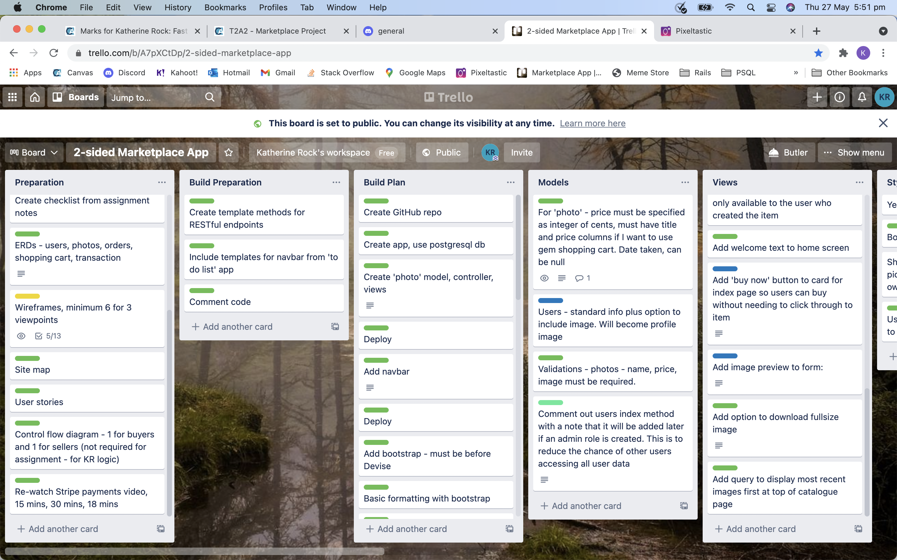
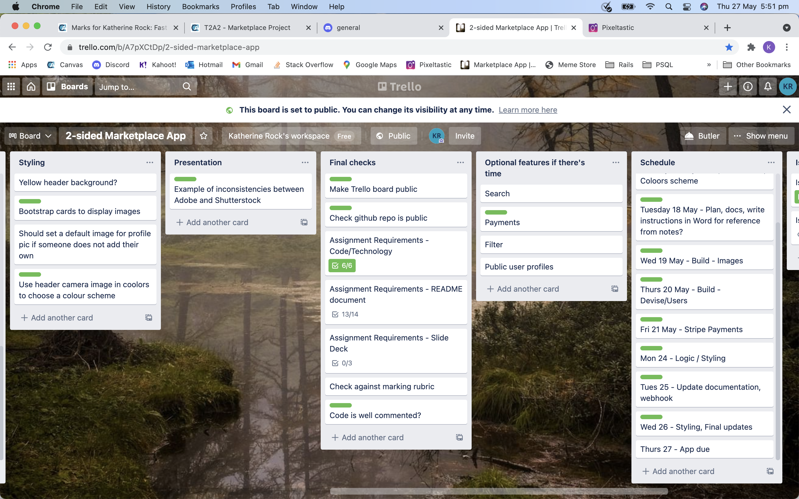

### References ###

Amazon, 2021. What is Amazon S3?. [Online] 
Available at: https://docs.aws.amazon.com/AmazonS3/latest/userguide/Welcome.html
[Accessed 26 May 2021].

França, R. & da Silva, C. A., 2021. Simple Form. [Online] 
Available at: https://github.com/heartcombo/simple_form
[Accessed 26 May 2021].

França, R., Tegon, L. & da Silva, C. A., 2021. Devise. [Online] 
Available at: https://github.com/heartcombo/devise
[Accessed 26 May 2021].

Heroku, 2020. GitHub Integration (Heroku GitHub Deploys). [Online] 
Available at: https://devcenter.heroku.com/articles/github-integration
[Accessed 26 May 2021].

Heroku, 2021. Heroku Products. [Online] 
Available at: https://www.heroku.com/products
[Accessed 26 May 2021].

Licensed by MIT, 2021. Bootstrap. [Online] 
Available at: https://getbootstrap.com/
[Accessed 26 May 2021].

Licensed by MIT, 2021. Pundit. [Online] 
Available at: https://github.com/varvet/pundit
[Accessed 26 May 2021].

Stripe, 2021. Stripe. [Online] 
Available at: https://stripe.com/en-au
[Accessed 26 May 2021].

Stripe, 2021. StripeDocs. [Online] 
Available at: https://stripe.com/docs/checkout/integration-builder
[Accessed 26 May 2021].

Ultrahook, 2021. UltraHook FAQ. [Online] 
Available at: https://www.ultrahook.com/faq
[Accessed 26 May 2021].